# EventPass — Complete CRUD Operations Documentation

> **Stack:** Laravel 13 · PHP 8.4 · MySQL · Blade + Tailwind CSS

---

## Table of Contents
1. [System Architecture](#1-system-architecture)
2. [Database Schema & Relationships](#2-database-schema--relationships)
3. [Request Lifecycle](#3-request-lifecycle)
4. [Routes Map](#4-routes-map)
5. [Middleware Chain](#5-middleware-chain)
6. [Model Relationships (Code)](#6-model-relationships)
7. [CREATE an Event](#7-create-an-event)
8. [READ Events](#8-read-events)
9. [UPDATE an Event](#9-update-an-event)
10. [DELETE an Event (Soft Delete)](#10-delete-an-event)
11. [BOOK a Ticket](#11-book-a-ticket)
12. [CANCEL a Ticket](#12-cancel-a-ticket)
13. [Admin CRUD Panel](#13-admin-crud-panel)
14. [File & Folder Structure](#14-file--folder-structure)

---

## 1. System Architecture

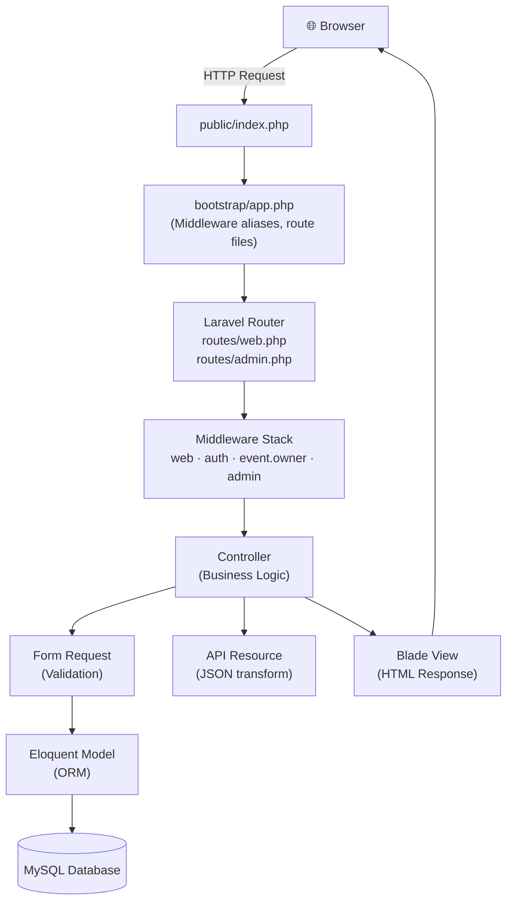

---

## 2. Database Schema & Relationships

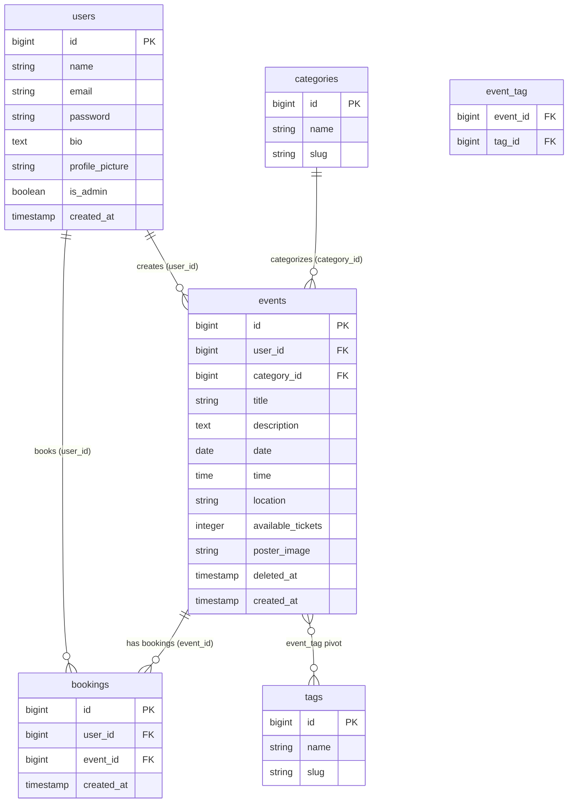

> **Key:** `deleted_at` on [events](file:///e:/PROJECTS/php_project-1/crud/app/Models/Tag.php#12-16) enables **Soft Deletes** — records are never physically removed until an admin force-deletes them.

---

## 3. Request Lifecycle

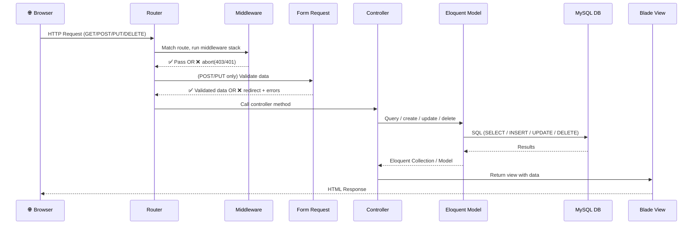

---

## 4. Routes Map

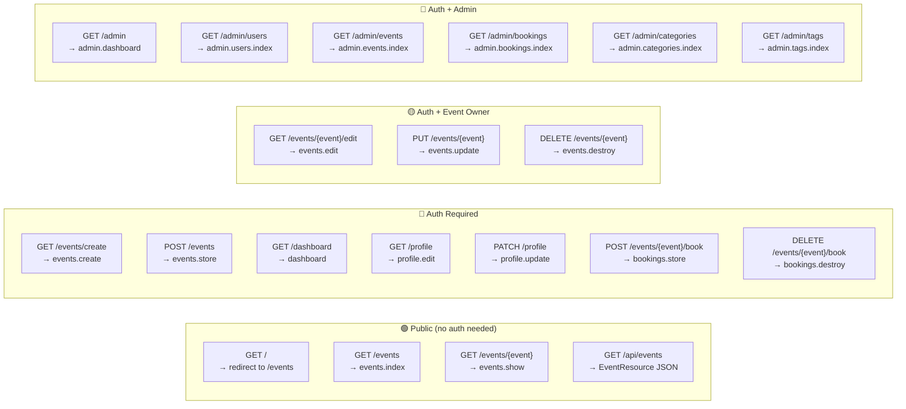

**Route ordering rule:** `/events/create` is declared **before** `/events/{event}` in [routes/web.php](file:///e:/PROJECTS/php_project-1/crud/routes/web.php). Without this, Laravel would match [create](file:///e:/PROJECTS/php_project-1/crud/app/Http/Controllers/EventController.php#23-29) as the `{event}` wildcard (ID = "create") → 404.

---

## 5. Middleware Chain

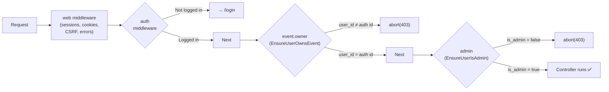

### [EnsureUserOwnsEvent.php](file:///e:/PROJECTS/php_project-1/crud/app/Http/Middleware/EnsureUserOwnsEvent.php) — Actual Code
```php
public function handle(Request $request, Closure $next): Response
{
    $event = $request->route('event');

    if (!$event instanceof Event) {
        $event = Event::findOrFail($event);
    }

    if ($event->user_id !== auth()->id()) {
        abort(403, 'Unauthorized. Only the event owner can do this.');
    }

    return $next($request);
}
```

### [EnsureUserIsAdmin.php](file:///e:/PROJECTS/php_project-1/crud/app/Http/Middleware/EnsureUserIsAdmin.php) — Actual Code
```php
public function handle(Request $request, Closure $next): Response
{
    if (!auth()->check() || !auth()->user()->is_admin) {
        abort(403, 'Access denied. Admins only.');
    }
    return $next($request);
}
```

---

## 6. Model Relationships

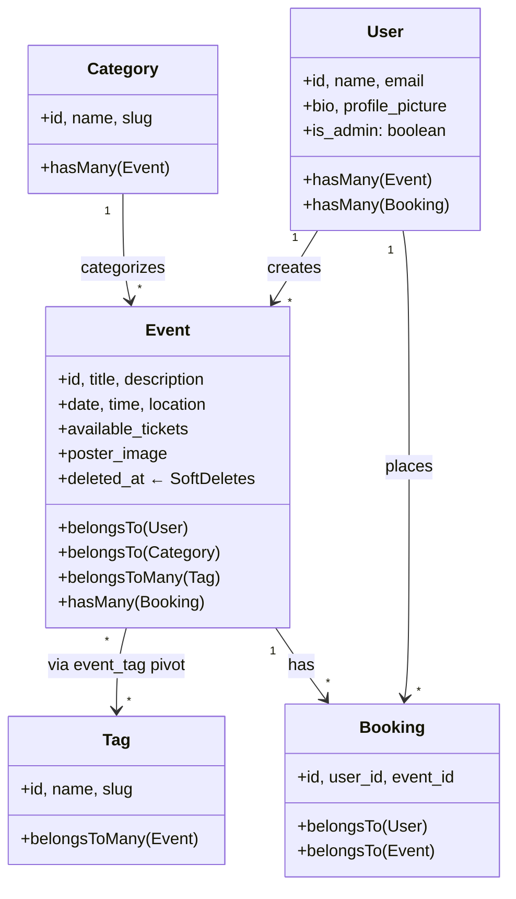

---

## 7. CREATE an Event

### Flow Diagram

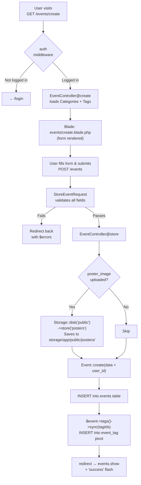

### Validation Rules ([StoreEventRequest](file:///e:/PROJECTS/php_project-1/crud/app/Http/Requests/StoreEventRequest.php#7-30))

| Field | Rule |
|---|---|
| `title` | `required\|string\|max:255` |
| `description` | `required\|string` |
| [date](file:///e:/PROJECTS/php_project-1/crud/app/Http/Controllers/EventController.php#64-81) | `required\|date\|after_or_equal:today` |
| `time` | `required` |
| `location` | `required\|string\|max:255` |
| `available_tickets` | `required\|integer\|min:1` |
| `category_id` | `required\|exists:categories,id` |
| `tags.*` | `exists:tags,id` |
| `poster_image` | `nullable\|image\|mimes:jpg,jpeg,png,webp\|max:2048` |

### Actual Controller Code
```php
// EventController@store
public function store(StoreEventRequest $request)
{
    $data = $request->validated();

    if ($request->hasFile('poster_image')) {
        $data['poster_image'] = $request->file('poster_image')
                                        ->store('posters', 'public');
    }

    $data['user_id'] = auth()->id();
    $event = Event::create($data);
    $event->tags()->sync($request->input('tags', []));

    return redirect()->route('events.show', $event)
                     ->with('success', 'Event created successfully!');
}
```

---

## 8. READ Events

### Index Page (Listing)

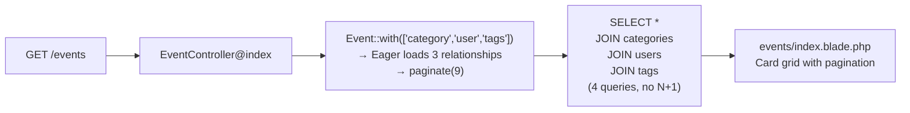

### Show Page (Single Event)

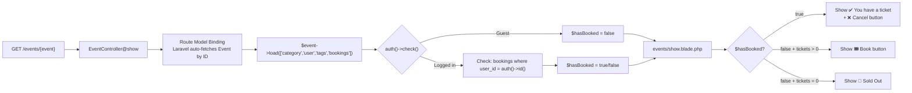

### Actual Controller Code
```php
// EventController@index
public function index()
{
    $events = Event::with(['category', 'user', 'tags'])
        ->latest()
        ->paginate(9);
    return view('events.index', compact('events'));
}

// EventController@show
public function show(Event $event)
{
    $event->load(['category', 'user', 'tags', 'bookings']);
    $hasBooked = auth()->check()
        ? $event->bookings()->where('user_id', auth()->id())->exists()
        : false;
    return view('events.show', compact('event', 'hasBooked'));
}
```

---

## 9. UPDATE an Event

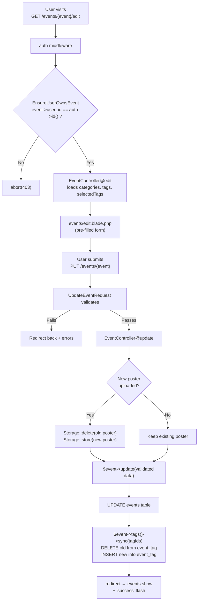

### Actual Controller Code
```php
// EventController@update
public function update(UpdateEventRequest $request, Event $event)
{
    $data = $request->validated();

    if ($request->hasFile('poster_image')) {
        if ($event->poster_image) {
            Storage::disk('public')->delete($event->poster_image);
        }
        $data['poster_image'] = $request->file('poster_image')
                                        ->store('posters', 'public');
    }

    $event->update($data);
    $event->tags()->sync($request->input('tags', []));

    return redirect()->route('events.show', $event)
                     ->with('success', 'Event updated successfully!');
}
```

**How `->sync()` works:**

```
Before: event has tags [1, 3, 5]
User selects:            [2, 3]

sync() does:
  DELETE FROM event_tag WHERE event_id=X AND tag_id IN (1, 5)
  INSERT INTO event_tag (event_id, tag_id) VALUES (X, 2)
  (tag 3 stays unchanged)
```

---

## 10. DELETE an Event

### Soft Delete vs Hard Delete

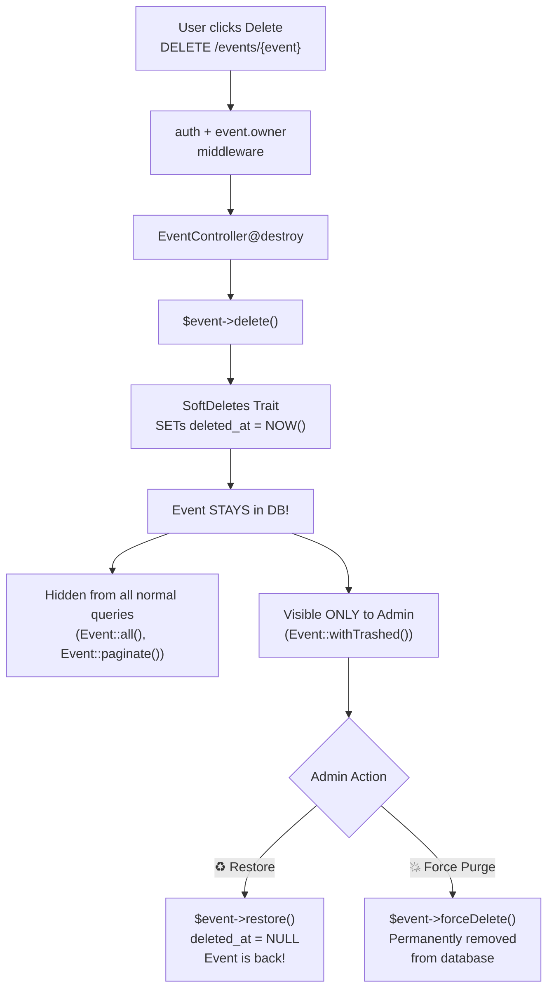

### How SoftDeletes Works Internally

```php
// Event Model
class Event extends Model
{
    use SoftDeletes;         // ← Just adding this trait is enough!
    // Laravel automatically:
    // - Adds WHERE deleted_at IS NULL to all queries
    // - Sets deleted_at timestamp on ->delete()
    // - Ignores the record from all relationships
}

// Controller
$event->delete();            // ← Sets deleted_at, NOT a real DELETE
$event->restore();           // ← Clears deleted_at
$event->forceDelete();       // ← Actual DELETE FROM events WHERE id=X
```

### SQL Generated

| Action | SQL |
|---|---|
| `->delete()` | `UPDATE events SET deleted_at = '2026-03-18...' WHERE id = 1` |
| Normal `Event::all()` | `SELECT * FROM events WHERE deleted_at IS NULL` |
| `Event::withTrashed()` | `SELECT * FROM events` (includes deleted) |
| `Event::onlyTrashed()` | `SELECT * FROM events WHERE deleted_at IS NOT NULL` |
| `->restore()` | `UPDATE events SET deleted_at = NULL WHERE id = 1` |
| `->forceDelete()` | `DELETE FROM events WHERE id = 1` |

---

## 11. BOOK a Ticket

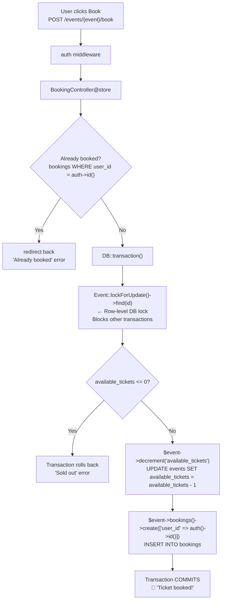

> **Why `lockForUpdate()`?** Without it, if 2 users book the last ticket simultaneously:
> - Both read `available_tickets = 1` ✅
> - Both decrement → `available_tickets = -1` ❌ (oversold!)
>
> With `lockForUpdate()`, the second user's transaction waits until the first commits, then reads `available_tickets = 0` → returns "Sold out".

### Actual Controller Code
```php
public function store(Request $request, Event $event)
{
    $alreadyBooked = $event->bookings()
                           ->where('user_id', auth()->id())
                           ->exists();
    if ($alreadyBooked) {
        return back()->with('error', 'Already booked!');
    }

    $updated = DB::transaction(function () use ($event) {
        $event = Event::lockForUpdate()->find($event->id);  // ← DB lock

        if ($event->available_tickets <= 0) {
            return false;
        }

        $event->decrement('available_tickets');
        $event->bookings()->create(['user_id' => auth()->id()]);

        return true;
    });

    if (!$updated) {
        return back()->with('error', 'Sorry, no tickets available.');
    }

    return back()->with('success', 'Ticket booked! 🎉');
}
```

---

## 12. CANCEL a Ticket

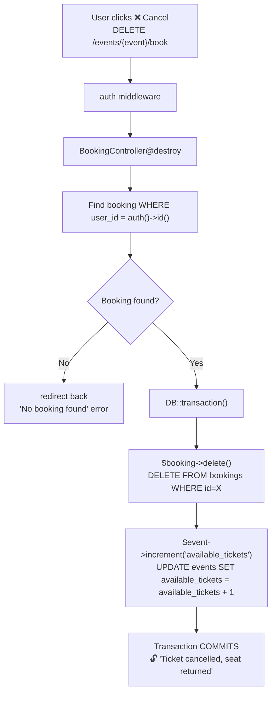

### Actual Controller Code
```php
public function destroy(Request $request, Event $event)
{
    $booking = $event->bookings()
                     ->where('user_id', auth()->id())
                     ->first();

    if (!$booking) {
        return back()->with('error', 'No booking found.');
    }

    DB::transaction(function () use ($booking, $event) {
        $booking->delete();
        $event->increment('available_tickets');  // ← Seat returned
    });

    return back()->with('success', 'Ticket cancelled. 🔓');
}
```

---

## 13. Admin CRUD Panel

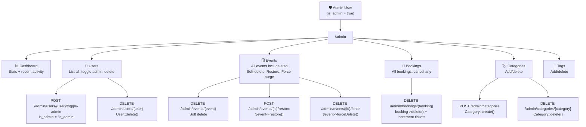

### How Admin Access Works

```php
// 1. Database: users.is_admin column (boolean, default: false)

// 2. Middleware checks
if (!auth()->user()->is_admin) {
    abort(403);
}

// 3. Grant admin (Tinker or Admin → Users page)
User::find(1)->update(['is_admin' => true]);

// 4. Revoke admin (Admin → Users page, click "Revoke Admin")
User::find(2)->update(['is_admin' => false]);
```

---

## 14. File & Folder Structure

```
app/
├── Http/
│   ├── Controllers/
│   │   ├── EventController.php          ← Create, Read, Update, Delete (soft)
│   │   ├── BookingController.php         ← Book ticket, Cancel ticket
│   │   ├── ProfileController.php         ← Profile update + avatar upload
│   │   ├── DashboardController.php       ← User dashboard (my events + bookings)
│   │   └── Admin/
│   │       ├── AdminDashboardController.php
│   │       ├── AdminUserController.php   ← List, toggle-admin, delete
│   │       ├── AdminEventController.php  ← List, soft-delete, restore, purge
│   │       ├── AdminBookingController.php← List, cancel
│   │       ├── AdminCategoryController.php← List, create, delete
│   │       └── AdminTagController.php    ← List, create, delete
│   ├── Middleware/
│   │   ├── EnsureUserOwnsEvent.php       ← Checks event->user_id = auth id
│   │   └── EnsureUserIsAdmin.php         ← Checks user->is_admin = true
│   ├── Requests/
│   │   ├── StoreEventRequest.php         ← Validation for CREATE
│   │   ├── UpdateEventRequest.php        ← Validation for UPDATE
│   │   └── ProfileUpdateRequest.php      ← Validation for profile
│   └── Resources/
│       └── EventResource.php             ← API JSON transformer
├── Models/
│   ├── User.php                          ← hasMany Events, Bookings
│   ├── Event.php                         ← SoftDeletes, belongsTo, hasMany, belongsToMany
│   ├── Category.php                      ← hasMany Events
│   ├── Tag.php                           ← belongsToMany Events
│   └── Booking.php                       ← belongsTo User + Event
├── Providers/
│   └── AppServiceProvider.php            ← Auto-discovered by Laravel
bootstrap/
│   └── app.php                           ← Registers middleware aliases
│                                            Loads routes/admin.php
routes/
│   ├── web.php                           ← All public + auth routes
│   ├── admin.php                         ← All /admin/* routes
│   └── auth.php                          ← Breeze auth routes (login, register, etc.)
database/
│   ├── migrations/
│   │   ├── create_categories_table.php
│   │   ├── create_events_table.php       ← includes deleted_at for SoftDeletes
│   │   ├── create_tags_table.php
│   │   ├── create_event_tag_table.php    ← Many-to-Many pivot
│   │   ├── create_bookings_table.php
│   │   ├── add_bio_and_profile_picture_to_users_table.php
│   │   └── add_is_admin_to_users_table.php
│   └── seeders/
│       └── DatabaseSeeder.php            ← Seeds 6 categories + 7 tags
resources/views/
│   ├── layouts/
│   │   ├── app.blade.php                 ← Breeze main layout
│   │   └── navigation.blade.php          ← Navbar (guest/auth/admin-aware)
│   ├── components/admin/
│   │   └── layout.blade.php              ← Dark sidebar admin layout (<x-admin.layout>)
│   ├── events/
│   │   ├── index.blade.php               ← Card grid + pagination
│   │   ├── show.blade.php                ← Detail, Book/Cancel, Edit/Delete
│   │   ├── create.blade.php              ← Create form (with tags, categories, file upload)
│   │   └── edit.blade.php                ← Edit form (pre-filled)
│   ├── admin/
│   │   ├── dashboard.blade.php
│   │   ├── users/index.blade.php
│   │   ├── events/index.blade.php
│   │   ├── bookings/index.blade.php
│   │   ├── categories/index.blade.php
│   │   └── tags/index.blade.php
│   ├── dashboard.blade.php               ← My events + attendees + my tickets
│   └── profile/
│       └── partials/
│           └── update-profile-information-form.blade.php
storage/app/public/
│   ├── posters/                          ← Event poster images
│   └── profile_pictures/                 ← User avatar images
public/storage → ← Symlink to storage/app/public (php artisan storage:link)
```

---

## Summary Table

| Operation | HTTP | URL | Auth | Validation | Special |
|---|---|---|---|---|---|
| List events | GET | `/events` | ❌ Public | — | Eager loading, pagination |
| View event | GET | `/events/{id}` | ❌ Public | — | Route Model Binding |
| Create form | GET | `/events/create` | ✅ auth | — | Loads categories + tags |
| Create event | POST | `/events` | ✅ auth | [StoreEventRequest](file:///e:/PROJECTS/php_project-1/crud/app/Http/Requests/StoreEventRequest.php#7-30) | File upload, tag sync |
| Edit form | GET | `/events/{id}/edit` | ✅ auth + owner | — | Pre-fills form |
| Update event | PUT | `/events/{id}` | ✅ auth + owner | [UpdateEventRequest](file:///e:/PROJECTS/php_project-1/crud/app/Http/Requests/UpdateEventRequest.php#7-30) | Replace image, re-sync tags |
| Delete event | DELETE | `/events/{id}` | ✅ auth + owner | — | **Soft delete** (sets `deleted_at`) |
| Book ticket | POST | `/events/{id}/book` | ✅ auth | — | DB transaction, row lock |
| Cancel ticket | DELETE | `/events/{id}/book` | ✅ auth | — | Restores `available_tickets` |
| Restore event | POST | `/admin/events/{id}/restore` | ✅ admin | — | Clears `deleted_at` |
| Purge event | DELETE | `/admin/events/{id}/force` | ✅ admin | — | **Permanent** `forceDelete()` |
| Toggle admin | POST | `/admin/users/{id}/toggle-admin` | ✅ admin | — | Flips `is_admin` bool |
| API JSON | GET | `/api/events` | ❌ Public | — | [EventResource](file:///e:/PROJECTS/php_project-1/crud/app/Http/Resources/EventResource.php#8-39) transformer |
